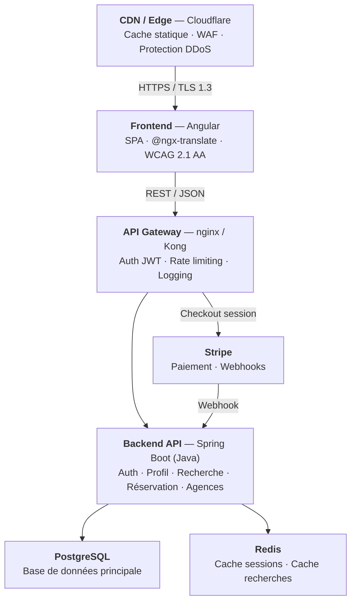
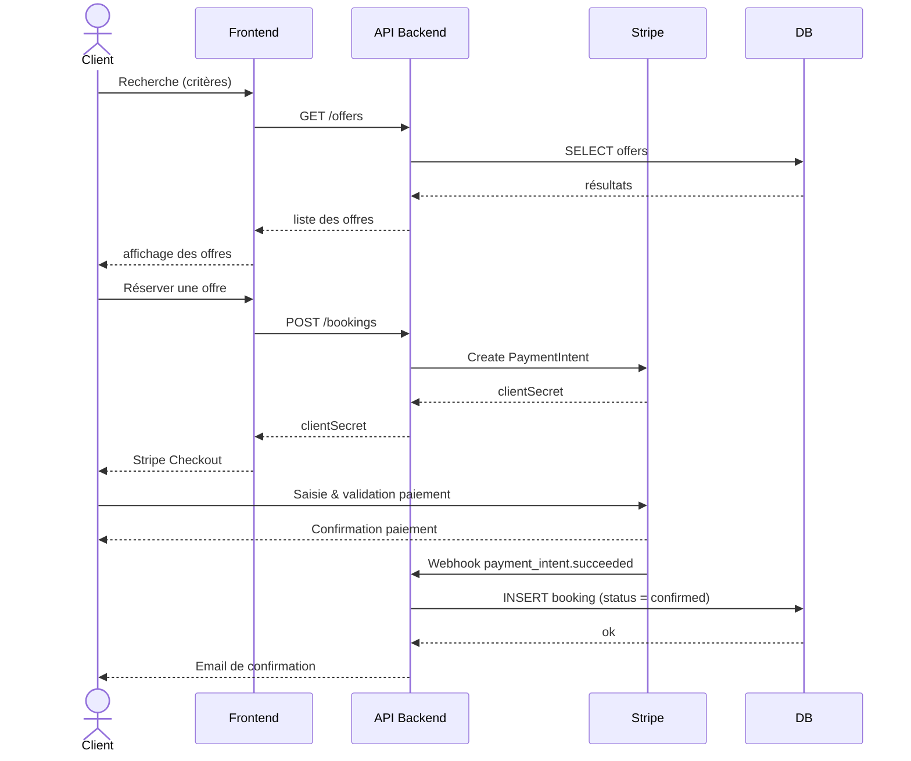
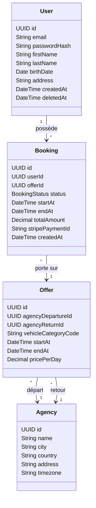
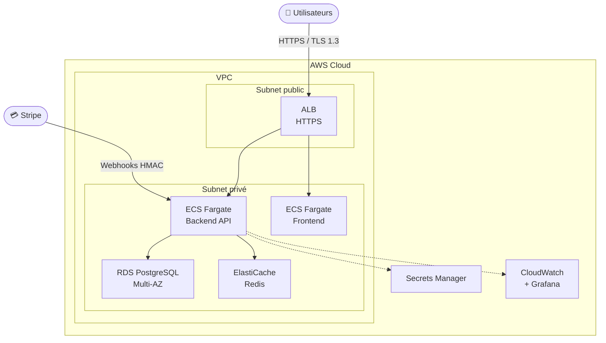
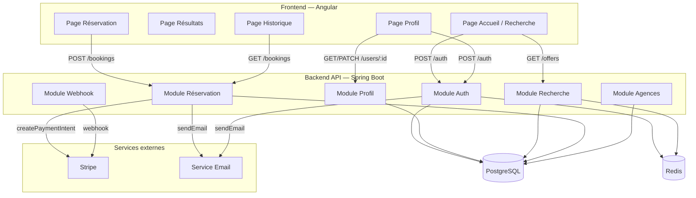
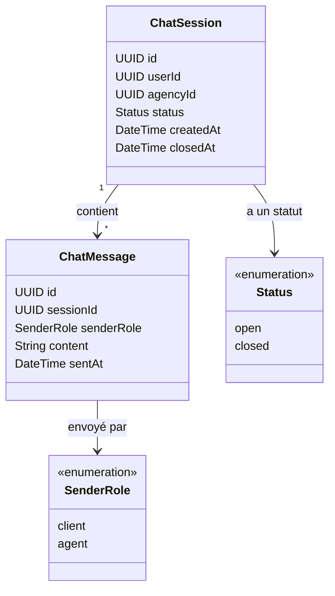
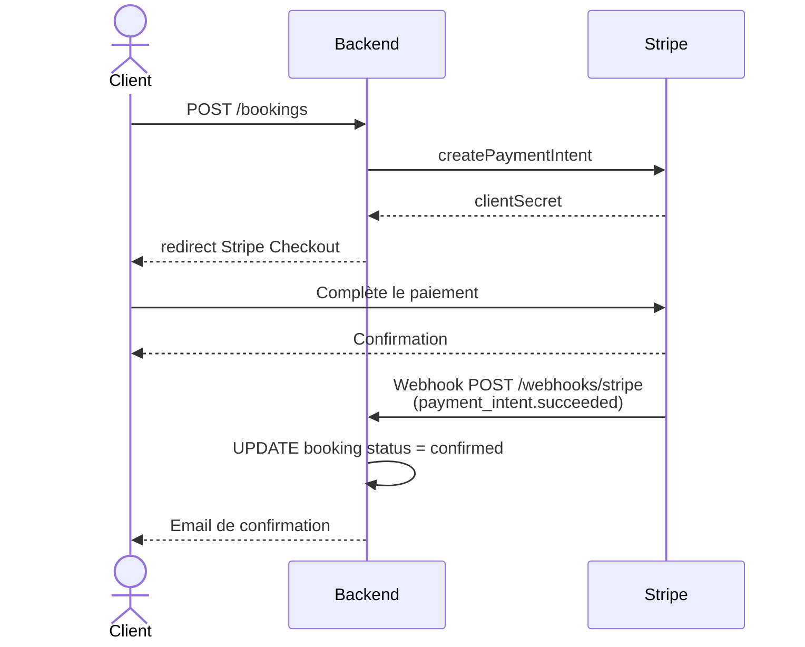
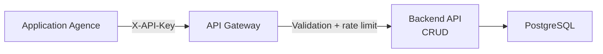

# Proposition d'architecture — Your Car Your Way

## Sommaire

1. [Audit de l'existant](#1-audit-de-lexistant)
2. [Spécifications techniques](#2-spécifications-techniques)
3. [Architecture cible](#3-architecture-cible)
4. [Modélisation UML](#4-modélisation-uml)
5. [Modèle de données](#5-modèle-de-données)
6. [Sélection et justification des technologies](#6-sélection-et-justification-des-technologies)
7. [Intégration des composants tiers](#7-intégration-des-composants-tiers)
8. [Bonnes pratiques](#8-bonnes-pratiques)

---

## 1. Audit de l'existant

### 1.1 Synthèse des applications actuelles

| Pays              | Backend     | Frontend      | Hébergement        | Architecture           |
| ----------------- | ----------- | ------------- | ------------------ | ---------------------- |
| FR / DE / ES / IT | Java EE     | JSP/JSF       | OVH (manuel)       | Monolithe              |
| UK                | PHP Laravel | Laravel Blade | AWS EC2            | Monolithe              |
| CA                | Node.js     | React         | AWS                | Monolithe              |
| US                | Spring Boot | Angular       | Azure App Services | Monolithe containerisé |

### 1.0 Critères d'évaluation

L'audit s'appuie sur les cinq critères suivants, définis en cohérence avec les objectifs de la refonte. La conclusion (§1.4) évalue l'existant au regard de chacun d'eux.

| Critère | Définition | Cible visée |
| --- | --- | --- |
| **Disponibilité** | Taux d'uptime annuel et temps de récupération après incident (MTTR) | ≥ 99,5 %, MTTR < 30 min |
| **Sécurité** | Robustesse face aux CVE, algorithmes de hashage, chiffrement, gestion des secrets | 0 CVE critique, Argon2id, TLS 1.3 |
| **Performance** | Capacité de charge (req/s) et taux d'erreur lors des pics saisonniers | ≥ 500 req/s, < 0,5 % erreurs |
| **Maintenabilité** | Cohérence du code, automatisation des déploiements, délai de stabilisation après release | Déploiement automatisé, rollback < 5 min |
| **Évolutivité** | Capacité à intégrer de nouveaux marchés ou fonctionnalités sans refonte majeure | Architecture unifiée, API-first |

---

### 1.2 Forces

- HTTPS activé sur toutes les applications.
- Stack US (Spring Boot / Angular) et CA (Node / React) comme bases de modernisation.
- UK et CA utilisent des algorithmes de hashage conformes (bcrypt, Argon2id).
- Application US containerisée, déploiement reproductible.

### 1.3 Faiblesses

**Disponibilité**

| Environnement     | Disponibilité | MTTR  | Taux déploiements OK |
| ----------------- | ------------- | ----- | -------------------- |
| FR/DE/ES/IT (OVH) | 97,2 %        | ~2h45 | 82 %                 |
| UK/CA (AWS)       | 98,1 – 98,6 % | ~1h10 | 91 %                 |
| US (Azure)        | 98,9 %        | ~1h10 | 91 %                 |

**Sécurité**

| Risque                                     | Niveau   |
| ------------------------------------------ | -------- |
| SHA-1 pour les mots de passe (FR/DE/ES/IT) | Critique |
| TLS 1.0 actif (FR/IT)                      | Critique |
| Secrets en fichiers de configuration       | Élevé    |
| 41 % des dépendances FR avec CVE connues   | Élevé    |

**Performance**

| Environnement | Charge max sans dégradation | Taux d'erreur pics |
| ------------- | --------------------------- | ------------------ |
| FR/DE/ES/IT   | ~150 req/s                  | jusqu'à 4 %        |
| UK            | ~250 req/s                  | 1,5 %              |
| CA            | ~300 req/s                  | 1,5 %              |
| US            | ~350 req/s                  | 0,8 %              |

**Maintenabilité** : 4 codebases sans partage de code, déploiements manuels sur OVH (82 % de réussite), sauvegardes non testées régulièrement.

### 1.4 Conclusion

| Critère        | Évaluation                                                                |
| -------------- | ------------------------------------------------------------------------- |
| Disponibilité  | Non satisfait — FR/DE/ES/IT en dessous de 99 %, MTTR incompatible        |
| Sécurité       | Non satisfait — vulnérabilités critiques sur la majorité des applications |
| Performance    | Non satisfait — aucune application n'atteint la charge cible de 500 req/s |
| Maintenabilité | Non satisfait — 4 codebases sans partage, déploiements manuels            |
| Évolutivité    | Partiellement satisfait — US containerisée, mais aucune API unifiée       |

Une refonte sur une architecture unifiée est justifiée.

---

## 2. Spécifications techniques

| Axe                     | Cible                        |
| ----------------------- | ---------------------------- |
| Disponibilité           | ≥ 99,5 %                     |
| MTTR                    | < 30 minutes                 |
| Charge sans dégradation | ≥ 500 req/s                  |
| Taux d'erreur pics      | < 0,5 %                      |
| Temps de réponse p95    | < 500 ms (pages critiques)   |
| Déploiement             | Automatisé, rollback < 5 min |
| Dépendances vulnérables | 0 CVE critique/élevée        |

**Contraintes** : i18n (FR, EN, DE, ES, IT), WCAG 2.1 AA / RGAA 4.1, RGPD / Loi 25, API RESTful OpenAPI 3.0, paiement délégué à Stripe (zéro donnée CB sur les serveurs YCYW).

---

## 3. Architecture cible

Architecture en couches avec API-first, déployée sur infrastructure cloud managée. Pas de microservices en V1 — la taille de l'équipe et le périmètre ne le justifient pas — mais préparée pour une extraction future des modules critiques (paiement, notifications).

### 3.1 Couches applicatives



### 3.2 Infrastructure cloud (AWS)

**Fournisseur retenu : AWS** (déjà utilisé pour UK/CA, équipes familières). ECS Fargate pour les conteneurs, RDS PostgreSQL Multi-AZ, ElastiCache Redis, AWS Secrets Manager.

---

## 4. Modélisation UML

### 4.1 Diagramme de cas d'utilisation


### 4.2 Diagramme de séquence — Réservation



### 4.3 Diagramme de classes (domaine métier)



### 4.4 Diagramme de déploiement



### 4.5 Diagramme de composants



### 4.6 Diagramme de classes — Module Tchat (SF-06)



> Les FK vers `users(id)` et `agencies(id)` sont présentes dans le schéma cible. Dans le PoC, elles sont simulées par des UUIDs fixes (`DEMO_USER_ID`, `DEMO_AGENCY_ID`) en l'absence des modules Auth et Agences.

---

## 5. Modèle de données

### 5.1 Tables principales (PostgreSQL)

```sql
CREATE TABLE users (
    id            UUID PRIMARY KEY DEFAULT gen_random_uuid(),
    email         VARCHAR(255) UNIQUE NOT NULL,
    password_hash TEXT NOT NULL,           -- Argon2id
    first_name    VARCHAR(100) NOT NULL,
    last_name     VARCHAR(100) NOT NULL,
    birth_date    DATE,
    address       TEXT,
    locale        VARCHAR(10) DEFAULT 'fr', -- BCP 47
    created_at    TIMESTAMPTZ NOT NULL DEFAULT NOW(),
    updated_at    TIMESTAMPTZ NOT NULL DEFAULT NOW(),
    deleted_at    TIMESTAMPTZ             -- soft delete RGPD
);

CREATE TABLE agencies (
    id         UUID PRIMARY KEY DEFAULT gen_random_uuid(),
    name       VARCHAR(255) NOT NULL,
    city       VARCHAR(100) NOT NULL,
    country    CHAR(2) NOT NULL,           -- ISO 3166-1 alpha-2
    address    TEXT,
    timezone   VARCHAR(50) NOT NULL,       -- IANA tz
    latitude   NUMERIC(9,6),
    longitude  NUMERIC(9,6),
    created_at TIMESTAMPTZ NOT NULL DEFAULT NOW()
);

CREATE TABLE offers (
    id                  UUID PRIMARY KEY DEFAULT gen_random_uuid(),
    agency_departure_id UUID NOT NULL REFERENCES agencies(id),
    agency_return_id    UUID NOT NULL REFERENCES agencies(id),
    vehicle_category    CHAR(4) NOT NULL,  -- code ACRISS
    start_at            TIMESTAMPTZ NOT NULL,
    end_at              TIMESTAMPTZ NOT NULL,
    price_per_day       NUMERIC(10,2) NOT NULL,
    currency            CHAR(3) NOT NULL DEFAULT 'EUR', -- ISO 4217
    available_count     INTEGER NOT NULL DEFAULT 1,
    created_at          TIMESTAMPTZ NOT NULL DEFAULT NOW(),
    CONSTRAINT offers_dates_check CHECK (end_at > start_at)
);

CREATE TABLE bookings (
    id                 UUID PRIMARY KEY DEFAULT gen_random_uuid(),
    user_id            UUID NOT NULL REFERENCES users(id),
    offer_id           UUID NOT NULL REFERENCES offers(id),
    status             VARCHAR(20) NOT NULL DEFAULT 'pending',
                       -- pending | confirmed | cancelled | completed
    first_name         VARCHAR(100) NOT NULL,
    last_name          VARCHAR(100) NOT NULL,
    total_amount       NUMERIC(10,2) NOT NULL,
    currency           CHAR(3) NOT NULL,
    stripe_payment_id  VARCHAR(255),
    stripe_session_id  VARCHAR(255),
    cancelled_at       TIMESTAMPTZ,
    cancellation_reason TEXT,
    created_at         TIMESTAMPTZ NOT NULL DEFAULT NOW(),
    updated_at         TIMESTAMPTZ NOT NULL DEFAULT NOW()
);

CREATE INDEX idx_bookings_user_id  ON bookings(user_id);
CREATE INDEX idx_bookings_offer_id ON bookings(offer_id);
CREATE INDEX idx_offers_departure  ON offers(agency_departure_id, start_at);
CREATE INDEX idx_offers_category   ON offers(vehicle_category);
```

### 5.2 Tables de tchat (module SF-06)

> **POC** : le module de tchat est développé de manière isolée. Les FK vers `users(id)` et `agencies(id)` sont présentes dans le schéma cible ci-dessous, mais absentes de la migration du POC car ces tables n'existent pas encore. Les IDs sont simulés avec des UUIDs fixes en dur (`DEMO_USER_ID`, `DEMO_AGENCY_ID`) le temps que les modules Auth et Agences soient implémentés.

```sql
CREATE TABLE chat_sessions (
    id         UUID PRIMARY KEY DEFAULT gen_random_uuid(),
    user_id    UUID NOT NULL REFERENCES users(id),
    agency_id  UUID NOT NULL REFERENCES agencies(id),
    status     VARCHAR(10) NOT NULL DEFAULT 'open'
               CONSTRAINT chat_sessions_status_check CHECK (status IN ('open', 'closed')),
    created_at TIMESTAMPTZ NOT NULL DEFAULT NOW(),
    closed_at  TIMESTAMPTZ
);

CREATE TABLE chat_messages (
    id          UUID PRIMARY KEY DEFAULT gen_random_uuid(),
    session_id  UUID NOT NULL REFERENCES chat_sessions(id) ON DELETE CASCADE,
    sender_role VARCHAR(10) NOT NULL
                CONSTRAINT chat_messages_role_check CHECK (sender_role IN ('client', 'agent')),
    content     TEXT NOT NULL,
    sent_at     TIMESTAMPTZ NOT NULL DEFAULT NOW()
);

CREATE INDEX idx_chat_messages_session_id ON chat_messages(session_id);
CREATE INDEX idx_chat_sessions_user_id    ON chat_sessions(user_id);
```

### 5.3 Statuts de réservation

| Statut      | Description                   |
| ----------- | ----------------------------- |
| `pending`   | Paiement initié, non confirmé |
| `confirmed` | Paiement validé par Stripe    |
| `cancelled` | Annulée par le client         |
| `completed` | Location terminée             |

### 5.4 Stratégie de migration

Déploiement progressif par marché (UK en premier), avec import des données historiques et run parallèle avant décommissionnement des anciens systèmes.

---

## 6. Sélection et justification des technologies

### 6.1 Frontend — Angular

| Critère              | Angular         | Next.js (React) | Vue.js / Nuxt |
| -------------------- | --------------- | --------------- | ------------- |
| TypeScript           | Natif           | Natif           | Optionnel     |
| i18n intégré         | ✅ @ngx-translate | ✅ next-intl   | ✅ vue-i18n   |
| SSR                  | ✅ Angular SSR  | ✅ natif        | ✅ Nuxt       |
| Accessibilité (CDK)  | ✅ Angular CDK  | Radix UI        | Headless UI   |
| Déjà utilisé chez YCYW | États-Unis    | Canada          | Non           |

**Choix retenu : Angular.** Stack déjà en production aux États-Unis, structure stricte adaptée à une application d'entreprise, TypeScript natif, Angular CDK pour l'accessibilité.

### 6.2 Backend — Spring Boot (Java)

| Critère               | Spring Boot         | NestJS              | Express.js |
| --------------------- | ------------------- | ------------------- | ---------- |
| Structure             | Opinionée (Spring)  | Opinionée (modules) | Libre      |
| OpenAPI auto-généré   | ✅ Springdoc        | ✅ @nestjs/swagger  | Manuel     |
| Maturité / robustesse | Très élevée         | Élevée              | Moyenne    |
| Déjà utilisé chez YCYW | États-Unis         | Non                 | Canada     |

**Choix retenu : Spring Boot.** Référence en environnement d'entreprise, déjà en production US, documentation API auto-générée via Springdoc (OpenAPI 3.0).

### 6.3 Base de données — PostgreSQL

| Critère                    | PostgreSQL | MySQL | MongoDB   |
| -------------------------- | ---------- | ----- | --------- |
| Transactions ACID          | ✅         | ✅    | Partiel   |
| Modèle relationnel         | ✅         | ✅    | ❌        |
| UUID natif                 | ✅         | Via extension | ✅   |
| Adapté réservations/paiements | ✅      | ✅    | ❌        |

**Choix retenu : PostgreSQL.** Modèle fortement relationnel, transactions ACID indispensables entre réservation et confirmation de paiement.

### 6.4 Cache — Redis

Stockage des sessions JWT avec révocation immédiate (suppression de compte, déconnexion forcée) et cache des résultats de recherche pour absorber les pics saisonniers.

### 6.5 Paiement — Stripe

Imposé par le cahier des charges. Stripe Checkout (page hébergée) : aucune donnée CB sur les serveurs YCYW, conformité PCI DSS déléguée. Webhooks pour la confirmation asynchrone.

### 6.6 Authentification — JWT + Redis

| Critère                       | JWT seul | Sessions serveur | JWT + Refresh Redis |
| ----------------------------- | -------- | ---------------- | ------------------- |
| Scalabilité horizontale       | ✅       | ❌               | ✅                  |
| Révocation immédiate          | ❌       | ✅               | ✅                  |
| Adapté suppression de compte  | ❌       | ✅               | ✅                  |

**Choix retenu :** Access Token JWT (15 min) + Refresh Token révocable en Redis (30 jours).

### 6.7 CI/CD — GitHub Actions

Pipeline : lint → tests → scan sécurité → build image Docker → déploiement AWS.

---

## 7. Intégration des composants tiers

### 7.1 Stripe



Vérification de la signature webhook via `stripe.webhooks.constructEvent()` — toute requête sans signature valide est rejetée (HTTP 400).

### 7.2 Service d'email

AWS SES ou Resend. Utilisé pour les confirmations de réservation et les réinitialisations de mot de passe.

### 7.3 API Agences



Clé API stockée dans AWS Secrets Manager. Opérations filtrées par `agency_id` (row-level filtering).

---

## 8. Bonnes pratiques

### 8.1 Sécurité

| Pratique      | Implémentation                                                 |
| ------------- | -------------------------------------------------------------- |
| Mots de passe | Argon2id                                                       |
| Transport     | HTTPS obligatoire, TLS 1.3                                     |
| Secrets       | AWS Secrets Manager, jamais en dur dans le code                |
| Headers HTTP  | CSP, X-Frame-Options, HSTS                                     |
| Injection SQL | ORM avec requêtes paramétrées uniquement                       |
| CSRF          | Cookie SameSite=Strict + vérification Origin                   |
| Dépendances   | Scan `npm audit` en CI, blocage si CVE critique                |

### 8.2 Accessibilité

| Critère              | Mesure                                                              |
| -------------------- | ------------------------------------------------------------------- |
| Structure sémantique | HTML5 natif (`<main>`, `<nav>`, `<section>`, `<article>`)           |
| Navigation clavier   | Focus visible, pas de pièges au clavier                             |
| Images               | `alt` descriptif sur images porteuses, `alt=""` sur décoratives     |
| Formulaires          | `<label>` explicite, `aria-describedby` pour erreurs                |
| Contraste            | ≥ 4,5:1 (texte normal), ≥ 3:1 (texte large) — vérifié par axe-core |
| Lecteurs d'écran     | `role="alert"` pour les messages dynamiques                         |
| Validation           | Audit automatisé `axe-core` en CI + revue manuelle trimestrielle   |

### 8.3 Impact écologique

| Pratique        | Détail                                                            |
| --------------- | ----------------------------------------------------------------- |
| Assets          | WebP/AVIF, lazy loading natif                                     |
| Bundle          | Lazy-loading de modules Angular, code splitting par route         |
| Requêtes réseau | Cache HTTP (ETag, Cache-Control), pagination serveur              |
| Hébergement     | AWS régions européennes (énergie renouvelable ~100 %)             |
| Monitoring      | Lighthouse Performance ≥ 85 requis en CI                         |
| Base de données | Indexes optimisés, requêtes N+1 interdites                        |
