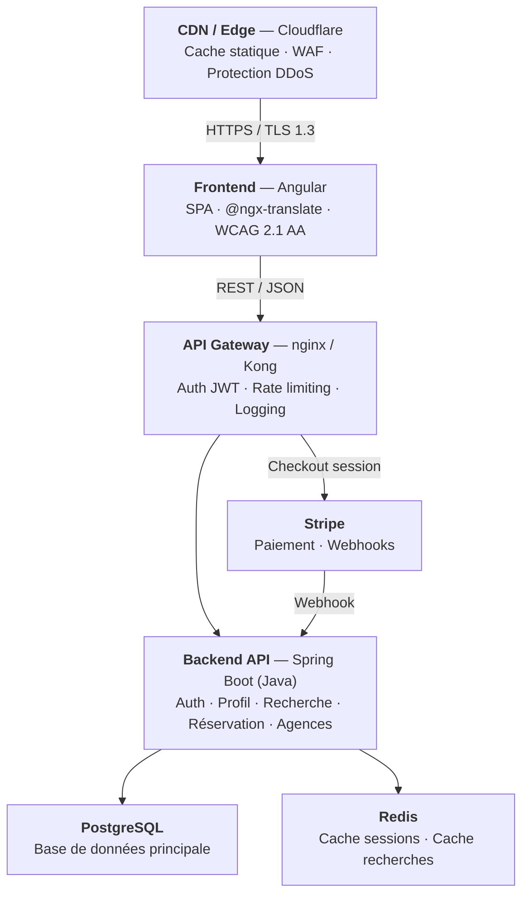
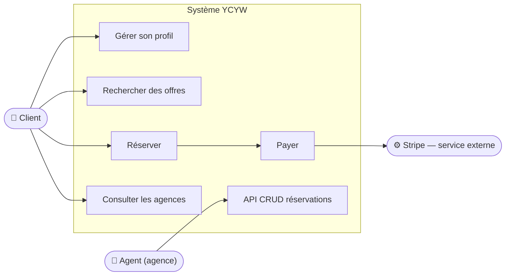
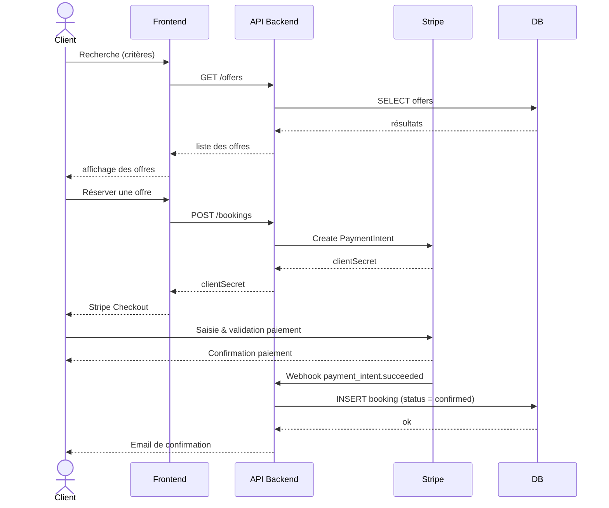
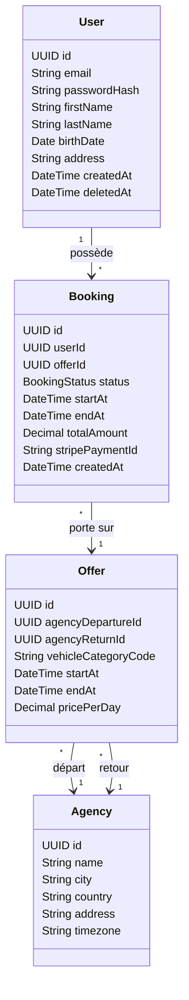
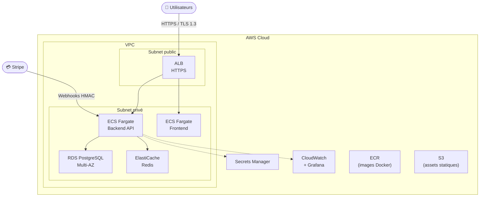
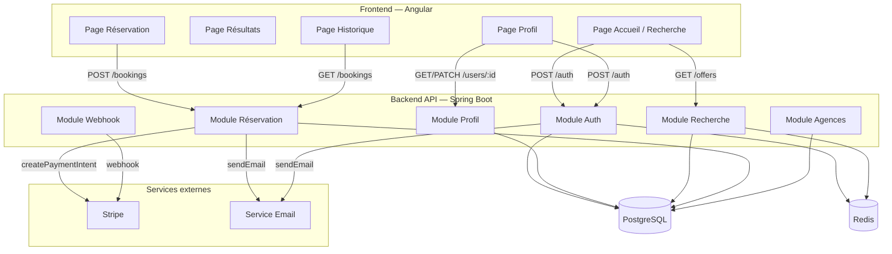
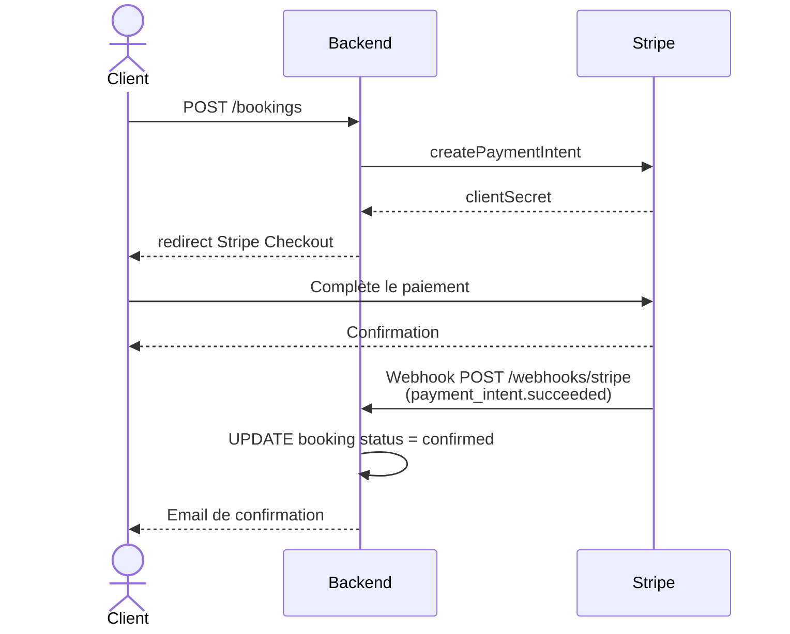
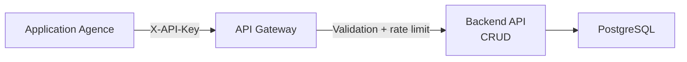

# Proposition d'architecture — Your Car Your Way

## Sommaire

1. [Audit de l'existant](#1-audit-de-lexistant)
2. [Spécifications techniques](#2-spécifications-techniques)
3. [Architecture cible](#3-architecture-cible)
4. [Modélisation UML](#4-modélisation-uml)
5. [Modèle de données](#5-modèle-de-données)
6. [Sélection et justification des technologies](#6-sélection-et-justification-des-technologies)
7. [Intégration des composants tiers](#7-intégration-des-composants-tiers)
8. [Bonnes pratiques](#8-bonnes-pratiques)

---

## 1. Audit de l'existant

### Introduction — Critères d'évaluation

Cet audit évalue les applications existantes selon cinq critères, définis en cohérence avec les objectifs du projet :

- **Disponibilité** : capacité du système à rester accessible, mesurée par le taux de disponibilité et le MTTR (temps moyen de récupération après incident).
- **Sécurité** : niveau de protection des données utilisateurs et des accès (hashage des mots de passe, chiffrement du trafic, gestion des secrets, vulnérabilités des dépendances).
- **Performance** : capacité à absorber la charge sans dégradation, notamment lors des pics saisonniers.
- **Maintenabilité** : facilité à faire évoluer, corriger et déployer les applications dans la durée.
- **Évolutivité** : aptitude de l'architecture à s'adapter à la croissance et à l'unification internationale.

### 1.1 Synthèse des applications actuelles

| Pays              | Backend     | Frontend      | Hébergement        | Architecture           |
| ----------------- | ----------- | ------------- | ------------------ | ---------------------- |
| FR / DE / ES / IT | Java EE     | JSP/JSF       | OVH (manuel)       | Monolithe              |
| UK                | PHP Laravel | Laravel Blade | AWS EC2            | Monolithe              |
| CA                | Node.js     | React         | AWS                | Monolithe              |
| US                | Spring Boot | Angular       | Azure App Services | Monolithe containerisé |

### 1.2 Forces

Malgré l'hétérogénéité de l'existant, plusieurs éléments positifs sont identifiables :

- **HTTPS activé sur l'ensemble des applications** : le chiffrement du trafic est présent partout, même si les versions de TLS varient.
- **Progression vers des stacks modernes** : l'application canadienne (React / Node.js) et américaine (Spring Boot / Angular) témoignent d'une volonté de modernisation, avec de meilleurs résultats en disponibilité et en performance.
- **Meilleures pratiques de sécurité sur les applications récentes** : UK utilise bcrypt, CA utilise Argon2id — les algorithmes de hashage sont conformes aux standards actuels sur ces marchés.
- **Seule application US est containerisée**, ce qui facilite la reproductibilité des déploiements et préfigure une infrastructure plus moderne.
- **Disponibilité satisfaisante sur les environnements cloud** : UK (98,6 %), CA (98,1 %) et US (98,9 %) atteignent des niveaux acceptables, avec un MTTR de ~1h10.
- **Présence de sauvegardes** sur tous les environnements, même si leur fiabilité est inégale.

### 1.3 Faiblesses

**Disponibilité**

| Environnement     | Disponibilité | MTTR  | Taux déploiements OK |
| ----------------- | ------------- | ----- | -------------------- |
| FR/DE/ES/IT (OVH) | 97,2 %        | ~2h45 | 82 %                 |
| UK/CA (AWS)       | 98,1 – 98,6 % | ~1h10 | 91 %                 |
| US (Azure)        | 98,9 %        | ~1h10 | 91 %                 |

Les applications FR/DE/ES/IT présentent un MTTR de 2h45, incompatible avec l'objectif cible de 99,5 %. Le taux de déploiements réussis de 82 % sur OVH (déploiements manuels) est un facteur de risque supplémentaire.

**Sécurité**

| Risque                                      | Détail                                              | Niveau   |
| ------------------------------------------- | --------------------------------------------------- | -------- |
| SHA-1 pour les mots de passe (FR/DE/ES/IT)  | Algorithme cassé depuis 2017                        | Critique |
| TLS 1.0 actif (FR/IT)                       | Protocole déprécié, vulnérable aux attaques connues | Critique |
| Secrets en fichiers de configuration        | Exposition en cas d'accès au serveur                | Élevé    |
| 41 % des dépendances FR avec CVE connues    | Surface d'attaque très large                        | Élevé    |
| Pas de rotation des secrets (UK/CA)         | Compromission durable en cas de fuite               | Moyen    |

**Performance**

| Environnement | Charge max sans dégradation | Taux d'erreur pics |
| ------------- | --------------------------- | ------------------ |
| FR/DE/ES/IT   | ~150 req/s                  | jusqu'à 4 %        |
| UK            | ~250 req/s                  | 1,5 %              |
| CA            | ~300 req/s                  | 1,5 %              |
| US            | ~350 req/s                  | 0,8 %              |

Aucune application n'atteint les 500 req/s cibles. Le taux d'erreur de 4 % lors des pics saisonniers sur FR/DE/ES/IT est directement visible par les utilisateurs.

**Maintenabilité**

- Quatre codebases indépendantes sans partage de code, entraînant une divergence progressive des fonctionnalités.
- Déploiements manuels sur OVH : source d'erreurs humaines et délai de stabilisation post-release de 3,4 jours.
- Sauvegardes non testées régulièrement sur FR/DE/ES/IT et UK/CA — la restauration n'est pas garantie.

### 1.4 Contraintes techniques

Ces éléments ne sont pas des faiblesses à corriger mais des réalités structurelles qui conditionnent les choix de la solution cible :

- **Schémas de données divergents** entre les six pays : une migration unifiée nécessitera un travail de normalisation important.
- **Aucune API commune** : les applications n'exposent pas d'interfaces standardisées, ce qui exclut une intégration progressive sans rupture.
- **Trois environnements d'hébergement différents** (OVH, AWS, Azure) : un choix de plateforme cible est nécessaire pour unifier les opérations.
- **Code copié entre pays** (FR → DE/ES/IT) : les bases de code ont divergé au fil du temps, rendant une mise à jour groupée risquée.

### 1.5 Conclusion de l'audit

| Critère         | Évaluation                                                                 |
| --------------- | -------------------------------------------------------------------------- |
| Disponibilité   | Non satisfait — FR/DE/ES/IT en dessous de 99 %, MTTR incompatible         |
| Sécurité        | Non satisfait — vulnérabilités critiques sur la majorité des applications  |
| Performance     | Non satisfait — aucune application n'atteint la charge cible de 500 req/s |
| Maintenabilité  | Non satisfait — 4 codebases sans partage, déploiements manuels             |
| Évolutivité     | Partiellement satisfait — US containerisée, mais aucune API unifiée        |

L'existant ne satisfait pas les critères définis pour la nouvelle plateforme. Les applications les plus récentes (CA, US) montrent que des améliorations sont possibles, mais elles restent isolées et ne peuvent pas servir de base commune. Une refonte sur une architecture unifiée est justifiée.

---

## 2. Spécifications techniques

### 2.1 Exigences

| Axe                     | Cible                        |
| ----------------------- | ---------------------------- |
| Disponibilité           | ≥ 99,5 %                     |
| MTTR                    | < 30 minutes                 |
| Charge sans dégradation | ≥ 500 req/s                  |
| Taux d'erreur pics      | < 0,5 %                      |
| Temps de réponse p95    | < 500 ms (pages critiques)   |
| Déploiement             | Automatisé, rollback < 5 min |
| Dépendances vulnérables | 0 CVE critique/élevée        |

### 2.2 Contraintes

- **Internationalisation** : support FR, EN, DE, ES, IT minimum.
- **Accessibilité** : WCAG 2.1 AA / RGAA 4.1.
- **Conformité** : RGPD (UE), Loi 25 (Québec).
- **API** : RESTful, documentée OpenAPI 3.0, consommable par les applications d'agence.
- **Paiement** : délégué à Stripe, zéro donnée CB sur les serveurs YCYW.

---

## 3. Architecture cible

### 3.1 Vue d'ensemble

L'architecture retenue est une **architecture en couches avec API-first**, déployée sur infrastructure cloud managée. Elle se distingue de l'existant par :

- Un frontend découplé du backend (SPA ou SSR).
- Une API RESTful unique consommée par le client web et par les outils d'agence.
- Une base de données unique centralisée remplaçant les 6 bases actuelles.
- Un pipeline CI/CD entièrement automatisé.
- Une infrastructure as code (IaC) pour reproductibilité.

Ce choix est volontairement conservateur par rapport à une architecture microservices : la taille de l'équipe, le périmètre V1 et la nécessité de livrer rapidement ne justifient pas la complexité opérationnelle d'une orchestration de services. L'architecture retenue est néanmoins **préparée pour une extraction future** de modules critiques (paiement, notifications) en services indépendants si la charge le requiert.

### 3.2 Couches applicatives



> Ce diagramme représente l'architecture en couches de l'application, de haut en bas : le CDN Cloudflare filtre le trafic entrant (WAF, protection DDoS), le frontend Angular gère l'interface côté client, l'API Gateway centralise l'authentification JWT et le rate limiting, puis le backend Spring Boot traite la logique métier et communique avec Stripe pour les paiements, PostgreSQL pour la persistance des données et Redis pour le cache des sessions et des recherches.

### 3.3 Infrastructure cloud

**Fournisseur retenu : AWS** (déjà utilisé pour UK/CA, équipes familières).

Les composants clés : ECS Fargate pour les conteneurs applicatifs, RDS PostgreSQL Multi-AZ pour la base de données avec failover automatique, ElastiCache Redis pour le cache, et AWS Secrets Manager pour la gestion des secrets. La redondance Multi-AZ répond directement aux lacunes identifiées dans l'audit (aucune réplication sur les environnements FR/DE/ES/IT).

---

## 4. Modélisation UML

### 4.1 Diagramme de cas d'utilisation



> Ce diagramme illustre les acteurs du système et leurs interactions. Le Client peut gérer son profil, rechercher des offres, consulter les agences et réserver — ce qui déclenche le paiement via Stripe, service externe. L'Agent en agence accède uniquement à l'API CRUD pour consulter et modifier les réservations, sans accès au portail client.

### 4.2 Diagramme de séquence — Réservation



> Ce diagramme détaille les échanges lors d'une réservation en deux phases. Phase recherche : le client soumet ses critères via le frontend, le backend interroge la base de données et renvoie les offres disponibles. Phase réservation : le backend crée un PaymentIntent Stripe et redirige le client vers Stripe Checkout ; une fois le paiement validé, Stripe envoie un webhook signé au backend, qui enregistre la réservation en base (statut confirmé) et envoie l'email de confirmation au client.

### 4.3 Diagramme de classes (domaine métier)



> Ce diagramme représente le modèle objet du domaine métier. Un utilisateur (User) possède zéro ou plusieurs réservations (Booking). Chaque réservation porte sur une offre (Offer) unique, identifiée par un code ACRISS pour la catégorie de véhicule. Une offre est associée à deux agences (Agency) : une agence de départ et une agence de retour, qui peuvent être différentes.

### 4.4 Diagramme de déploiement



> Ce diagramme représente l'infrastructure AWS. Les utilisateurs accèdent à l'application via un Application Load Balancer situé dans le subnet public, qui distribue le trafic vers les tâches ECS Fargate (backend et frontend) dans le subnet privé. Le backend communique avec RDS PostgreSQL Multi-AZ pour la persistance et ElastiCache Redis pour le cache. Stripe envoie ses webhooks directement au backend. Les services transverses (Secrets Manager pour les secrets, CloudWatch pour l'observabilité) sont accessibles depuis le backend en liaison pointillée.

### 4.5 Diagramme de composants



> Ce diagramme de composants montre les modules internes du backend et les pages du frontend, ainsi que leurs interactions. Chaque module Spring Boot est responsable d'un domaine métier : Auth gère les tokens JWT, Profil les données personnelles, Recherche les offres disponibles, Réservation le cycle complet de booking, Agences les données d'agence, et Webhook la réception des événements Stripe. Les modules utilisent PostgreSQL pour la persistance ; Auth et Recherche utilisent également Redis pour les sessions et le cache.

---

## 5. Modèle de données

### 5.1 Tables principales (PostgreSQL)

```sql
-- Utilisateurs
CREATE TABLE users (
    id          UUID PRIMARY KEY DEFAULT gen_random_uuid(),
    email       VARCHAR(255) UNIQUE NOT NULL,
    password_hash TEXT NOT NULL,           -- Argon2id
    first_name  VARCHAR(100) NOT NULL,
    last_name   VARCHAR(100) NOT NULL,
    birth_date  DATE,
    address     TEXT,
    locale      VARCHAR(10) DEFAULT 'fr',  -- BCP 47
    created_at  TIMESTAMPTZ NOT NULL DEFAULT NOW(),
    updated_at  TIMESTAMPTZ NOT NULL DEFAULT NOW(),
    deleted_at  TIMESTAMPTZ                -- soft delete RGPD
);

-- Agences
CREATE TABLE agencies (
    id          UUID PRIMARY KEY DEFAULT gen_random_uuid(),
    name        VARCHAR(255) NOT NULL,
    city        VARCHAR(100) NOT NULL,
    country     CHAR(2) NOT NULL,          -- ISO 3166-1 alpha-2
    address     TEXT,
    timezone    VARCHAR(50) NOT NULL,      -- IANA tz
    latitude    NUMERIC(9,6),
    longitude   NUMERIC(9,6),
    created_at  TIMESTAMPTZ NOT NULL DEFAULT NOW()
);

-- Offres de location
CREATE TABLE offers (
    id                   UUID PRIMARY KEY DEFAULT gen_random_uuid(),
    agency_departure_id  UUID NOT NULL REFERENCES agencies(id),
    agency_return_id     UUID NOT NULL REFERENCES agencies(id),
    vehicle_category     CHAR(4) NOT NULL,  -- code ACRISS
    start_at             TIMESTAMPTZ NOT NULL,
    end_at               TIMESTAMPTZ NOT NULL,
    price_per_day        NUMERIC(10,2) NOT NULL,
    currency             CHAR(3) NOT NULL DEFAULT 'EUR',  -- ISO 4217
    available_count      INTEGER NOT NULL DEFAULT 1,
    created_at           TIMESTAMPTZ NOT NULL DEFAULT NOW(),
    CONSTRAINT offers_dates_check CHECK (end_at > start_at)
);

-- Réservations
CREATE TABLE bookings (
    id                 UUID PRIMARY KEY DEFAULT gen_random_uuid(),
    user_id            UUID NOT NULL REFERENCES users(id),
    offer_id           UUID NOT NULL REFERENCES offers(id),
    status             VARCHAR(20) NOT NULL DEFAULT 'pending',
                       -- pending | confirmed | cancelled | completed
    first_name         VARCHAR(100) NOT NULL,
    last_name          VARCHAR(100) NOT NULL,
    total_amount       NUMERIC(10,2) NOT NULL,
    currency           CHAR(3) NOT NULL,
    stripe_payment_id  VARCHAR(255),
    stripe_session_id  VARCHAR(255),
    cancelled_at       TIMESTAMPTZ,
    cancellation_reason TEXT,
    created_at         TIMESTAMPTZ NOT NULL DEFAULT NOW(),
    updated_at         TIMESTAMPTZ NOT NULL DEFAULT NOW()
);

-- Index pour les requêtes fréquentes
CREATE INDEX idx_bookings_user_id ON bookings(user_id);
CREATE INDEX idx_bookings_offer_id ON bookings(offer_id);
CREATE INDEX idx_offers_departure ON offers(agency_departure_id, start_at);
CREATE INDEX idx_offers_category ON offers(vehicle_category);

-- Sessions de tchat support
CREATE TABLE chat_sessions (
    id          UUID PRIMARY KEY DEFAULT gen_random_uuid(),
    user_id     UUID NOT NULL REFERENCES users(id),
    agency_id   UUID NOT NULL REFERENCES agencies(id),
    status      VARCHAR(10) NOT NULL DEFAULT 'open',
                -- open | closed
    created_at  TIMESTAMPTZ NOT NULL DEFAULT NOW(),
    closed_at   TIMESTAMPTZ
);

-- Messages de tchat
CREATE TABLE chat_messages (
    id          UUID PRIMARY KEY DEFAULT gen_random_uuid(),
    session_id  UUID NOT NULL REFERENCES chat_sessions(id),
    sender_role VARCHAR(10) NOT NULL,  -- 'client' | 'agent'
    content     TEXT NOT NULL,
    sent_at     TIMESTAMPTZ NOT NULL DEFAULT NOW()
);

CREATE INDEX idx_chat_messages_session_id ON chat_messages(session_id);
```

### 5.2 Énumération des statuts de réservation

| Statut      | Description                   |
| ----------- | ----------------------------- |
| `pending`   | Paiement initié, non confirmé |
| `confirmed` | Paiement validé par Stripe    |
| `cancelled` | Annulée par le client         |
| `completed` | Location terminée             |

### 5.3 Stratégie de migration

Déploiement progressif par marché (UK en premier, le plus proche techniquement), avec un script d'import des données historiques et une période de run parallèle avant décommissionnement des anciens systèmes.

---

## 6. Sélection et justification des technologies

### 6.1 Frontend — Angular

**Options comparées** :

| Critère | Angular | Next.js (React) | Vue.js / Nuxt |
|---|---|---|---|
| TypeScript | Natif | Natif | Optionnel |
| i18n intégré | ✅ @ngx-translate | ✅ next-intl | ✅ vue-i18n |
| SSR | ✅ Angular Universal | ✅ natif | ✅ Nuxt |
| Accessibilité (CDK) | ✅ Angular CDK | Radix UI | Headless UI |
| Déjà utilisé chez YCYW | États-Unis | Canada | Non |
| Cohérence avec le backend | ✅ (Spring Boot = stack US) | Partielle | Non |

**Choix retenu : Angular.** La stack Angular / Spring Boot est déjà en production aux États-Unis, identifiée comme la piste de modernisation technique de l'entreprise. Angular impose une structure stricte (modules, services, guards) qui convient à une application d'entreprise à grande échelle. TypeScript est natif, et l'écosystème Angular CDK offre des outils d'accessibilité solides.

### 6.2 Backend — Spring Boot (Java)

**Options comparées** :

| Critère | Spring Boot | NestJS | Express.js |
|---|---|---|---|
| Structure | Opinionée (Spring) | Opinionée (modules) | Libre |
| Langage | Java | TypeScript | JavaScript/TS |
| OpenAPI auto-généré | ✅ Springdoc | ✅ @nestjs/swagger | Manuel |
| Maturité / robustesse | Très élevée | Élevée | Moyenne |
| Déjà utilisé chez YCYW | États-Unis | Non | Canada |
| Cohérence avec le frontend | ✅ (stack US validée) | Partielle (TS only) | Partielle |

**Choix retenu : Spring Boot.** Spring Boot est une référence en environnement d'entreprise, avec un écosystème mature (sécurité, transactions, JPA). Il est déjà en production sur le marché US, ce qui valide sa compatibilité avec l'infrastructure YCYW. La documentation API est auto-générée via Springdoc (OpenAPI 3.0), satisfaisant l'exigence du cahier des charges.

### 6.3 Base de données — PostgreSQL

**Options comparées** :

| Critère | PostgreSQL | MySQL | MongoDB |
|---|---|---|---|
| Transactions ACID | ✅ | ✅ | Partiel (4.0+) |
| Modèle relationnel | ✅ | ✅ | ❌ |
| UUID natif | ✅ | Via extension | ✅ |
| Adapté réservations/paiements | ✅ | ✅ | ❌ |
| Support JSONB (flexibilité) | ✅ | Limité | ✅ |

**Choix retenu : PostgreSQL.** Le modèle de données est fortement relationnel (User → Booking → Offer → Agency). Les transactions ACID sont indispensables pour garantir la cohérence entre la création d'une réservation et la confirmation du paiement. MongoDB est écarté car il ne garantit pas les transactions multi-collections nécessaires à ce flux.

### 6.4 Cache — Redis

**Choix** : Redis (AWS ElastiCache).

- Stockage des sessions utilisateurs avec révocation immédiate (suppression de compte, déconnexion forcée).
- Cache des résultats de recherche pour absorber les pics saisonniers.
- Alternative Memcached écartée : pas de structure de données avancée ni de persistance optionnelle.

### 6.5 Paiement — Stripe

**Choix imposé par le cahier des charges.**

- Stripe Checkout (page hébergée) : aucune donnée de carte bancaire ne transite par les serveurs YCYW, conformité PCI DSS déléguée à Stripe.
- Webhooks pour la confirmation asynchrone du paiement.

### 6.6 Authentification — JWT + Redis

**Choix** : Access Token JWT (courte durée) + Refresh Token stocké en Redis (30 jours).

| Critère | JWT seul | Sessions serveur | JWT + Refresh Redis |
|---|---|---|---|
| Scalabilité horizontale | ✅ | ❌ (sticky sessions) | ✅ |
| Révocation immédiate | ❌ | ✅ | ✅ |
| Adapté suppression de compte | ❌ | ✅ | ✅ |

**Choix retenu** : la combinaison JWT (accès court) + Refresh Token révocable en Redis répond aux deux contraintes : scalabilité horizontale et révocation immédiate en cas de suppression de compte.

### 6.7 CI/CD — GitHub Actions

**Choix** : GitHub Actions pour le pipeline d'intégration et de déploiement continu.

- Natif GitHub, sans infrastructure CI supplémentaire à gérer.
- Pipeline : lint → tests → scan sécurité → build image Docker → déploiement sur AWS.

---

## 7. Intégration des composants tiers

### 7.1 Stripe



> Ce diagramme détaille le flux de paiement Stripe : le client initie une réservation, le backend crée un PaymentIntent et redirige le client vers Stripe Checkout (page hébergée par Stripe, aucune donnée CB ne transite par les serveurs YCYW). Une fois le paiement complété, Stripe envoie un webhook signé HMAC au backend, qui met à jour le statut de la réservation à "confirmé" et envoie l'email de confirmation au client.

**Sécurité webhook** : vérification de la signature HMAC via `stripe.webhooks.constructEvent()` avec la clé secrète de webhook — toute requête sans signature valide est rejetée avec HTTP 400.

### 7.2 Service d'email (transactionnel)

**Choix recommandé** : AWS SES ou Resend.

- Emails de confirmation de réservation.
- Emails de réinitialisation de mot de passe.
- Template HTML accessible (ratio texte/image, alt text).

### 7.3 API Agences (consommateurs internes)



> Ce diagramme illustre le flux d'authentification des applications d'agence : la requête est envoyée avec une clé API dans le header `X-API-Key`, l'API Gateway valide cette clé et applique le rate limiting avant de transmettre la requête au backend CRUD, qui interroge PostgreSQL. Les opérations sont filtrées par `agency_id` pour limiter chaque agence à ses propres données.

L'API key est stockée dans AWS Secrets Manager côté agence. Les opérations sont limitées aux ressources autorisées par agence (row-level filtering sur `agency_id`).

---

## 8. Bonnes pratiques

### 8.1 Sécurité

| Pratique      | Implémentation                                                 |
| ------------- | -------------------------------------------------------------- |
| Mots de passe | Argon2id (algorithme recommandé post-2015)                     |
| Transport     | HTTPS obligatoire, TLS 1.3                                     |
| Secrets       | AWS Secrets Manager, jamais en dur dans le code                |
| Headers HTTP  | Helmet.js (CSP, X-Frame-Options, HSTS)                         |
| Injection SQL | ORM avec requêtes paramétrées uniquement                       |
| CSRF          | Cookie SameSite=Strict + vérification Origin                   |
| Dépendances   | Scan `npm audit` dans la CI, blocage si vulnérabilité critique |

### 8.2 Accessibilité

| Critère              | Mesure                                                                    |
| -------------------- | ------------------------------------------------------------------------- |
| Structure sémantique | HTML5 natif (`<main>`, `<nav>`, `<section>`, `<article>`)                 |
| Navigation clavier   | Focus visible, `tabindex` rationalisé, pas de pièges au clavier           |
| Images               | `alt` descriptif sur images porteuses, `alt=""` sur images décoratives    |
| Formulaires          | `<label>` explicite pour chaque champ, `aria-describedby` pour erreurs    |
| Contraste            | Ratio ≥ 4,5:1 (texte normal), ≥ 3:1 (texte large) — vérifié par axe       |
| Lecteurs d'écran     | Alertes `role="alert"` pour les messages dynamiques                       |
| Responsive           | Pas de défilement horizontal à 320 px de largeur                          |
| Validation           | Audit automatisé `axe-core` dans les tests + revue manuelle trimestrielle |

### 8.3 Impact écologique

| Pratique        | Détail                                                                     |
| --------------- | -------------------------------------------------------------------------- |
| Assets          | Images en format WebP/AVIF, lazy loading natif (`loading="lazy"`)          |
| Bundle          | Lazy-loading de modules Angular, code splitting par route                  |
| Requêtes réseau | Cache HTTP (ETag, Cache-Control), pagination serveur                       |
| Hébergement     | AWS régions européennes (énergie renouvelable ~100 % pour Paris/Frankfurt) |
| Monitoring      | Score Lighthouse Performance ≥ 85 requis en CI (lighthouse-ci)             |
| Base de données | Indexes optimisés, VACUUM automatique PostgreSQL, requêtes N+1 interdites  |
