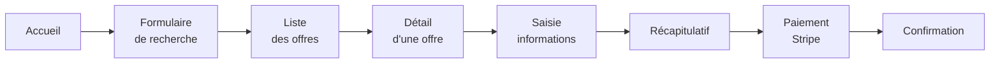

# Cahier des charges — Your Car Your Way

## Objet du document

Ce cahier des charges définit les exigences fonctionnelles, les besoins utilisateurs et les contraintes réglementaires de la nouvelle application centralisée Your Car Your Way. Il consolide les besoins métier existants, les complète et intègre les exigences d'accessibilité conformément au référentiel RGAA 4.1.

---

## Contexte

Your Car Your Way est une entreprise de location de voitures présente depuis plus de vingt ans en Europe, récemment implantée en Amérique du Nord. Elle opère actuellement via plusieurs applications distinctes (France, Allemagne, Espagne, Italie, Royaume-Uni, Canada, États-Unis), développées indépendamment avec des technologies hétérogènes.

Cette fragmentation génère :

- Une complexité technique croissante (4 stacks différentes, aucune API unifiée).
- Des incohérences fonctionnelles entre marchés (règles métier locales divergentes).
- Des difficultés de maintenance et de sécurité (41 % des dépendances FR avec CVE connues, SHA-1 pour les mots de passe).

L'objectif est de remplacer l'ensemble de ces applications par une plateforme centralisée, internationale, accessible et maintenable.

---

## Périmètre

### Inclus dans la V1

- Portail client web accessible depuis tous les marchés.
- Gestion du profil utilisateur.
- Recherche et réservation de véhicules.
- Paiement en ligne via fournisseur externe (Stripe).
- API RESTful consommée par les applications d'agence (usage interne CRUD).

### Hors périmètre V1

- Application mobile native.
- Back-office employés (gestion de flotte, planning agence).
- Programme de fidélité.
- Intégration de systèmes GDS (Global Distribution System).

---

## Parties prenantes

| Rôle | Implication |
|---|---|
| Client final | Utilisateur principal de l'application web |
| Agent en agence | Consommateur de l'API interne (lecture/modification réservations) |
| Équipe DSI | Exploitation, sécurité, déploiement |
| Partenaire paiement (Stripe) | Traitement des transactions |
| Autorités réglementaires | Conformité RGPD, accessibilité RGAA/WCAG 2.1 |

---

## Analyse des besoins utilisateurs

### Personas

#### Persona 1 — Client régulier (Maria, 34 ans, Barcelone)

- Utilise l'application depuis un smartphone en déplacement.
- Effectue plusieurs locations par an pour des voyages professionnels.
- Besoins : rapidité de réservation, historique accessible, modification facile.
- Frustrations actuelles : devoir ressaisir ses informations à chaque réservation.

#### Persona 2 — Client occasionnel (Thomas, 52 ans, Lyon)

- Peu à l'aise avec les interfaces numériques.
- Réserve 1 à 2 fois par an pour des vacances.
- Besoins : interface simple, messages d'erreur clairs, confirmation visible.
- Exigences d'accessibilité : taille de police ajustable, contraste suffisant.

#### Persona 3 — Utilisateur en situation de handicap (Amara, 29 ans, Londres)

- Malvoyante, utilise un lecteur d'écran (NVDA + Firefox).
- Besoins : navigation clavier complète, labels ARIA cohérents, ordre de focus logique.
- Exigences réglementaires : conformité WCAG 2.1 niveau AA, RGAA 4.1.

#### Persona 4 — Agent en agence (Kenji, 41 ans, Toronto)

- Accède à l'API pour consulter les réservations et mettre à jour les statuts.
- Besoins : API stable, documentation claire, réponses rapides.

### Parcours utilisateur principal — Réservation

> Ce diagramme représente le parcours complet d'un client lors d'une réservation : depuis la page d'accueil, il remplit le formulaire de recherche, consulte la liste des offres disponibles, sélectionne une offre pour en voir le détail, saisit ses informations personnelles, vérifie le récapitulatif, procède au paiement via Stripe, puis reçoit la confirmation de sa réservation.

---

## Spécifications fonctionnelles

### SF-01 — Authentification et gestion de compte

| ID | Fonctionnalité | Priorité |
|---|---|---|
| SF-01-01 | Créer un compte (email + mot de passe) | Haute |
| SF-01-02 | Se connecter / déconnecter | Haute |
| SF-01-03 | Réinitialiser son mot de passe par email | Haute |
| SF-01-04 | Supprimer son compte (confirmation par mot de passe) | Haute |

**Règle métier** : La suppression de compte nécessite la saisie du mot de passe actuel. Les données personnelles sont anonymisées conformément au RGPD (droit à l'oubli). Les réservations futures actives bloquent la suppression jusqu'à leur annulation ou expiration.

### SF-02 — Gestion du profil

| ID | Fonctionnalité | Priorité |
|---|---|---|
| SF-02-01 | Consulter son profil | Haute |
| SF-02-02 | Modifier nom, prénom, date de naissance, adresse | Haute |
| SF-02-03 | Modifier son email (confirmation par lien) | Moyenne |
| SF-02-04 | Modifier son mot de passe | Haute |
| SF-02-05 | Gérer ses préférences de communication (emails marketing) | Basse |

### SF-03 — Recherche de véhicules

| ID | Fonctionnalité | Priorité |
|---|---|---|
| SF-03-01 | Afficher la liste des agences de location | Haute |
| SF-03-02 | Rechercher des offres via formulaire | Haute |
| SF-03-03 | Filtrer / trier les résultats | Moyenne |
| SF-03-04 | Consulter le détail d'une offre | Haute |

**Critères du formulaire de recherche** :
- Ville de départ (autocomplétion)
- Ville de retour (autocomplétion, peut différer)
- Date et heure de début
- Date et heure de retour
- Catégorie de véhicule (norme ACRISS)

**Règle métier** : La date de retour doit être postérieure d'au moins 2 heures à la date de départ.

**Catégories ACRISS** : L'application utilise la classification ACRISS standard (Mini, Économique, Compacte, Intermédiaire, Standard, Plein format, Premium, Luxe, SUV, Cabriolet, Monospace, etc.).

### SF-04 — Réservation

| ID | Fonctionnalité | Priorité |
|---|---|---|
| SF-04-01 | Réserver une offre de location | Haute |
| SF-04-02 | Pré-remplissage depuis le profil | Haute |
| SF-04-03 | Récapitulatif avant paiement | Haute |
| SF-04-04 | Paiement via Stripe | Haute |
| SF-04-05 | Confirmation par email | Haute |
| SF-04-06 | Consulter l'historique des réservations | Haute |
| SF-04-07 | Modifier une réservation | Haute |
| SF-04-08 | Annuler une réservation | Haute |

**Règles métier** :

- **Modification** : possible jusqu'à 48 heures avant le début de la réservation.
- **Annulation et remboursement** :
  - Plus de 7 jours avant le départ : remboursement intégral.
  - Moins de 7 jours avant le départ : remboursement de 25 % du montant total uniquement.
  - Moins de 48 heures avant le départ : aucun remboursement, modification impossible.
- **Paiement** : externalisé via Stripe. Aucune donnée de carte bancaire ne transite par les serveurs YCYW.

### SF-05 — API interne (usage agences)

| ID | Fonctionnalité | Priorité |
|---|---|---|
| SF-05-01 | CRUD utilisateurs | Haute |
| SF-05-02 | CRUD réservations | Haute |
| SF-05-03 | CRUD véhicules / offres | Haute |
| SF-05-04 | CRUD agences | Haute |
| SF-05-05 | Authentification par clé API ou JWT service | Haute |

### SF-06 — Tchat support en temps réel

| ID | Fonctionnalité | Priorité |
|---|---|---|
| SF-06-01 | Initier une session de tchat avec le support d'une agence | Haute |
| SF-06-02 | Envoyer et recevoir des messages en temps réel | Haute |
| SF-06-03 | Consulter l'historique des messages de la session en cours | Moyenne |
| SF-06-04 | Fermer une session de tchat | Moyenne |

**Règles métier** :

- Un client connecté peut ouvrir une session de tchat avec l'agence de son choix (depuis la page agence ou depuis une réservation active).
- Les messages sont transmis en temps réel via WebSocket (protocole STOMP) — aucun rechargement de page requis.
- L'historique de la conversation est persisté en base de données et rechargé à la réouverture de la session.
- Une session peut être fermée par le client ou l'agent ; elle passe alors au statut `closed`.
- La connexion WebSocket est authentifiée par JWT (le token est transmis à l'établissement de la connexion).

**Exigences d'accessibilité** :

- La fenêtre de tchat est navigable au clavier (focus piégé dans la fenêtre modale, Échap pour fermer).
- Les nouveaux messages entrants sont annoncés par un `role="log"` pour les lecteurs d'écran.
- Le champ de saisie est labellisé (`<label>` ou `aria-label`).

---

## Exigences non fonctionnelles

### Accessibilité

- Conformité **WCAG 2.1 niveau AA** (norme européenne EN 301 549).
- Conformité **RGAA 4.1** pour les marchés français.
- Navigation entièrement fonctionnelle au clavier.
- Compatibilité avec les lecteurs d'écran principaux : NVDA, JAWS, VoiceOver.
- Contraste minimum 4,5:1 pour les textes normaux, 3:1 pour les textes larges.
- Textes alternatifs sur toutes les images porteuses d'information.
- Messages d'erreur de formulaire explicites et visuellement associés au champ concerné.
- Pas de contenu animé ou clignotant susceptible de provoquer des crises.

### Sécurité

- Mots de passe hashés avec **Argon2id** (vainqueur Password Hashing Competition).
- **HTTPS obligatoire**, TLS 1.3. (Les applications actuelles FR/IT utilisent encore TLS 1.0 — identifié comme vulnérabilité critique dans l'audit de l'existant.)
- Secrets stockés dans un **gestionnaire de secrets** (HashiCorp Vault ou équivalent cloud-native), jamais en dur dans le code.
- Rotation automatique des secrets d'accès aux services tiers.
- Protection contre OWASP Top 10 : injection SQL, XSS, CSRF, etc.
- Journalisation des accès et des actions sensibles (authentification, modification de réservation, suppression de compte).

### Performance

- Temps de réponse p95 < 500 ms pour les pages critiques (recherche, réservation).
- Disponibilité cible : **99,5 %** (vs 97,2 % actuel pour les apps FR/DE/ES/IT).
- Taux d'erreur lors des pics saisonniers < 0,5 % (vs jusqu'à 4 % actuellement).
- Charge supportée sans dégradation : ≥ 500 req/s (vs 150 req/s actuel FR).

### Internationalisation (i18n)

- Support multilingue : FR, EN, DE, ES, IT à minima.
- Gestion des fuseaux horaires (stockage UTC, affichage local).
- Formats de date/heure adaptés par locale.
- Conformité RGPD (UE) et loi 25 (Québec).

### Éco-conception

- Score Lighthouse Performance ≥ 85 sur desktop et mobile.
- Optimisation des assets (lazy loading, compression images WebP/AVIF).
- Pagination côté serveur pour éviter les surcharges réseau.
- Pas de requêtes inutiles côté client (cache HTTP, ETags).

---

## Contraintes et dépendances

| Contrainte | Détail |
|---|---|
| Stripe | Intégration obligatoire pour le paiement ; webhooks pour statuts de paiement |
| ACRISS | Classification des véhicules conforme à la norme |
| RGPD | Consentement explicite, droit d'accès et d'effacement |
| API agences | Rétrocompatibilité attendue lors du déploiement progressif |

---

## Product Backlog — User Stories

Le backlog complet (vue Kanban, chronologie, filtres par sprint et critères d'acceptation) est disponible sur Notion :
**[→ Voir le backlog sur Notion](https://anthony-gorski.notion.site/Your-Car-Your-Way-38a381ed55f480dbaf15e09569dc617c?pvs=74)** *(lien externe)*

Le tableau ci-dessous en présente la vue synthétique. Le backlog est planifié sur **3,3 mois** (Sprint 0 à Sprint 7) pour un total de **111 story points**.

| ID | Titre | Épic | Priorité | Sprint | SP | Statut |
|---|---|---|---|---|---|---|
| US#00 | Tchat support en temps réel (PoC) | PoC | Haute | Sprint 0 | 8 | En cours |
| US#01 | Créer un compte | Auth | Haute | Sprint 1 | 3 | En cours |
| US#02 | Se connecter | Auth | Haute | Sprint 1 | 2 | En cours |
| US#03 | Se déconnecter | Auth | Haute | Sprint 1 | 1 | En cours |
| US#04 | Réinitialiser son mot de passe | Auth | Haute | Sprint 1 | 3 | En cours |
| US#05 | Setup environnement (Docker + BDD) | Infra | Haute | Sprint 1 | 5 | En cours |
| US#06 | Consulter son profil | Profil | Haute | Sprint 2 | 2 | Backlog |
| US#07 | Modifier ses informations personnelles | Profil | Haute | Sprint 2 | 3 | Backlog |
| US#08 | Modifier son email | Profil | Moyenne | Sprint 2 | 3 | Backlog |
| US#09 | Modifier son mot de passe | Profil | Haute | Sprint 2 | 2 | Backlog |
| US#10 | Supprimer son compte | Profil | Haute | Sprint 2 | 5 | Backlog |
| US#11 | Consulter la liste des agences | Recherche | Haute | Sprint 3 | 2 | Backlog |
| US#12 | Rechercher des offres de location | Recherche | Haute | Sprint 3 | 5 | Backlog |
| US#13 | Filtrer et trier les résultats | Recherche | Moyenne | Sprint 3 | 3 | Backlog |
| US#14 | Consulter le détail d'une offre | Recherche | Haute | Sprint 3 | 2 | Backlog |
| US#15 | Réserver une offre | Réservation | Haute | Sprint 4 | 5 | Backlog |
| US#16 | Pré-remplir depuis le profil | Réservation | Haute | Sprint 4 | 2 | Backlog |
| US#17 | Payer via Stripe | Réservation | Haute | Sprint 5 | 8 | Backlog |
| US#18 | Recevoir une confirmation par email | Réservation | Haute | Sprint 5 | 3 | Backlog |
| US#19 | Consulter l'historique des réservations | Réservation | Haute | Sprint 4 | 3 | Backlog |
| US#20 | Modifier une réservation | Réservation | Haute | Sprint 4 | 5 | Backlog |
| US#21 | Annuler une réservation | Réservation | Haute | Sprint 5 | 5 | Backlog |
| US#22 | API — CRUD utilisateurs | API Agences | Haute | Sprint 6 | 5 | Backlog |
| US#23 | API — CRUD réservations | API Agences | Haute | Sprint 6 | 5 | Backlog |
| US#24 | API — CRUD offres | API Agences | Haute | Sprint 6 | 4 | Backlog |
| US#25 | API — CRUD agences | API Agences | Haute | Sprint 7 | 3 | Backlog |
| US#26 | API — Authentification par clé | API Agences | Haute | Sprint 7 | 3 | Backlog |
| US#27 | Navigation entièrement au clavier | Accessibilité | Haute | Sprint 7 | 5 | Backlog |
| US#28 | Compatibilité lecteurs d'écran | Accessibilité | Haute | Sprint 7 | 5 | Backlog |

**Total : 29 user stories — 111 story points — 3,3 mois**

> Les critères d'acceptation détaillés pour chaque US sont disponibles sur Notion (lien ci-dessus). Les extraits clés ci-dessous couvrent les US à plus forte valeur métier.

---

## Critères d'acceptation — extraits clés

### US#01 — Créer un compte

**Valide si :**
- Le formulaire exige un email valide et un mot de passe d'au moins 8 caractères.
- Le mot de passe est hashé avec Argon2id avant stockage — jamais en clair.
- Un email de confirmation est envoyé dans les 60 secondes.
- Un email déjà utilisé retourne un message d'erreur explicite sans révéler si le compte existe.

### US#10 — Supprimer son compte

**Valide si :**
- La suppression nécessite la saisie du mot de passe actuel.
- Une réservation future active bloque la suppression (message d'erreur clair).
- Les données personnelles sont anonymisées dans la base (soft delete via `deleted_at`).
- Toutes les sessions actives sont immédiatement invalidées.

### US#15 — Réserver une offre

**Valide si :**
- Les informations personnelles sont pré-remplies depuis le profil si disponibles.
- Un récapitulatif complet (offre, dates, prix total, infos client) est affiché avant paiement.
- La réservation est créée avec statut `pending` avant la redirection vers Stripe.
- Après confirmation Stripe (webhook), le statut passe à `confirmed` et un email est envoyé.

### US#20 — Modifier une réservation

**Valide si :**
- La modification est acceptée si la date de début est **à plus de 48 heures**.
- La modification est refusée si la date de début est **à moins de 48 heures** (message explicite).
- Le récapitulatif mis à jour est affiché avant confirmation.

### US#21 — Annuler une réservation

**Valide si :**

| Délai avant départ | Remboursement attendu |
|---|---|
| Plus de 7 jours | 100 % du montant total |
| Moins de 7 jours | 25 % du montant total |
| Moins de 48 heures | 0 % (annulation impossible) |

- Le montant remboursé est affiché avant confirmation de l'annulation.
- Le statut passe à `cancelled` et `cancelled_at` est horodaté.

### US#00 — Tchat support en temps réel (PoC)

**Valide si :**
- Un client peut ouvrir une session de tchat et envoyer un message.
- Le message apparaît chez l'agent **sans rechargement de page**, en moins d'une seconde.
- L'historique de la session est rechargé après reconnexion (persisté en base).
- La fenêtre de tchat est navigable au clavier et compatible lecteurs d'écran (`role="log"`).
- La fermeture de session est notifiée aux deux participants en temps réel.

