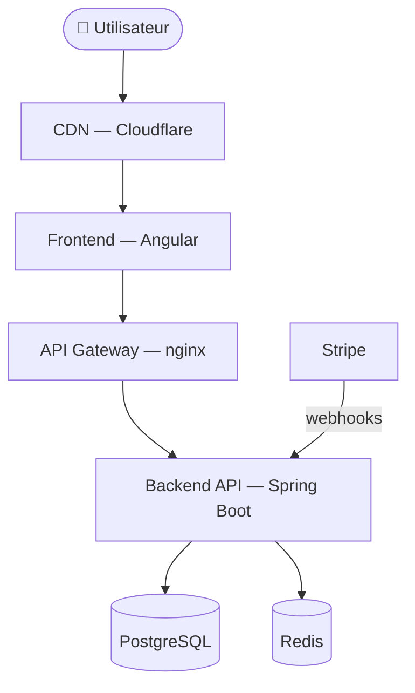

# Résumé du projet — Your Car Your Way

Référence rapide pour l'équipe. Pour le détail complet : [architecture.md](architecture.md) et [cahier_des_charges.md](cahier_des_charges.md).

---

## Contexte

Application web centralisée de location de voitures, remplaçant 6 applications distinctes (FR, DE, ES, IT, UK, CA, US). Cible : tous les clients YCYW à l'international.

---

## Stack technique retenue

| Couche | Technologie | Pourquoi |
|---|---|---|
| Frontend | Angular (TypeScript) | Stack validée en production (US), CDK accessibilité |
| Backend | Spring Boot (Java) | Stack validée en production (US), maturité entreprise |
| Base de données | PostgreSQL (AWS RDS) | ACID, transactions réservation/paiement |
| Cache | Redis (AWS ElastiCache) | Sessions, cache recherches |
| Paiement | Stripe | Imposé CDC, PCI DSS délégué |
| Authentification | JWT (access 15 min) + Refresh Token Redis | Révocable, scalable |
| CI/CD | GitHub Actions | Natif, pipeline lint→test→build→deploy |
| Hébergement | AWS (ECS Fargate, RDS, ElastiCache) | Équipes familières, Multi-AZ |
| CDN / WAF | Cloudflare | Filtrage DDoS, cache statique |

---

## Architecture — Vue synthétique

**Pattern** : architecture en couches, API-first. Pas de microservices en V1 (équipe et périmètre ne le justifient pas).

---

## Domaine métier — Entités clés

| Entité | Rôle |
|---|---|
| `User` | Compte client, profil, authentification |
| `Agency` | Agence de départ / retour |
| `Offer` | Offre de location (agences + dates + catégorie ACRISS + tarif) |
| `Booking` | Réservation d'une offre par un utilisateur, liée à un paiement Stripe |

Relations : `User` 1→N `Booking`, `Booking` N→1 `Offer`, `Offer` N→1 `Agency` (×2).

---

## Fonctionnalités V1 (résumé)

| Bloc | Fonctionnalités |
|---|---|
| SF-01 Compte | Créer, connexion, réinitialisation MDP, suppression |
| SF-02 Profil | Consulter, modifier informations personnelles |
| SF-03 Recherche | Formulaire (ville, dates, catégorie ACRISS), liste et détail offres |
| SF-04 Réservation | Réserver, payer (Stripe), historique, modifier (≥48h), annuler |
| SF-05 API agences | CRUD complet exposé aux outils internes |

---

## Règles métier importantes

- Modification possible jusqu'à **48h** avant le départ.
- Annulation **< 7 jours** : remboursement de 25 % seulement.
- Suppression de compte : saisie du mot de passe obligatoire + blocage si réservation active.
- Catégories véhicules : norme **ACRISS**.

---

## Intégrations tierces

| Service | Usage | Mécanisme |
|---|---|---|
| Stripe | Paiement | Checkout hosted + webhook HMAC |
| AWS SES / Resend | Emails transactionnels | Confirmation, reset MDP |
| API Agences | CRUD interne | Clé API (X-API-Key) |

---

## Contraintes non fonctionnelles clés

- Disponibilité cible : **99,5 %**
- Performance : **< 500 ms** p95, **≥ 500 req/s** sans dégradation
- Accessibilité : **WCAG 2.1 AA** / RGAA 4.1
- Sécurité : Argon2id, TLS 1.3, secrets managés
- i18n : FR, EN, DE, ES, IT minimum
- RGPD (UE) + Loi 25 (Québec)
